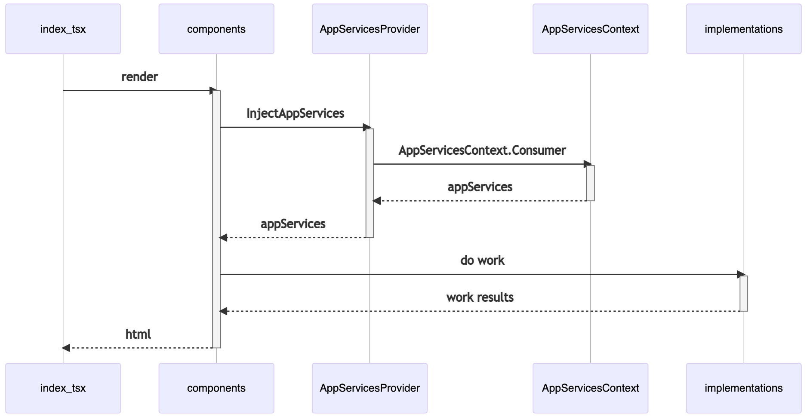
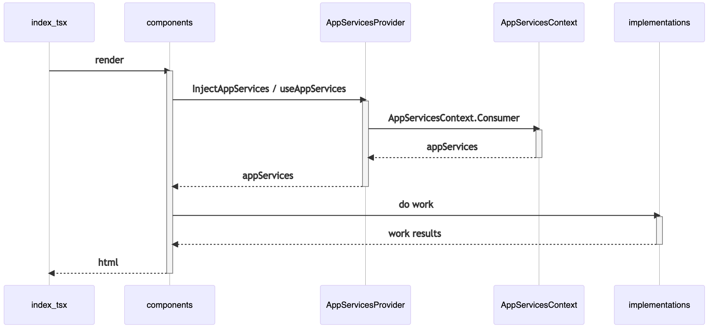

# Doppler SMS Micro-Frontend

It is a POC for adding a new WebApp to Doppler complementing the [new WebApp](https://github.com/FromDoppler/doppler-webapp) (`app.fromdoppler.com`)
and the [old MVC UI](https://github.com/MakingSense/Doppler/tree/develop/Doppler.Presentation.MVC) (`app2.fromdoppler.com`).

From the user point of view, this should be the same application. But, from ours, it is a different
application deployed independently and loose coupled to the other ones.

By the moment, we will relay on Doppler user's JWT Token and `GetUserData`, and probably, in the
future we will try to use OAuth 2 in place.

On the other hand, we will use our _Manifest Loader_ <!-- TODO: add the link to the documentation here -->
in order to take advantage of the cache and simplify the release process. CI/CD process will be very
similar to our API micro-services (for example [Hello Microservice](https://github.com/FromDoppler/hello-microservice#context)),
but based on manifest files in our CDN in place of Docker images.

## TODO

- [ ] Add linting for Dockerfile
- [ ] Review Renovate configuration based on our recent learnings
- [x] Add sample pages with data loading and saving
- [x] Review Session management, probably we could copy the simplified version from Menu MFE
- [x] ~~Consider removing AppConfigurationRenderer~~
- [x] Cleanup components
- [x] Add a page in our Swarm including Menu MFE and Style Guide
  - See PR [#712](https://github.com/MakingSense/doppler-swarm/pull/712)
- [ ] Hide contents until Menu MFE and Style Guide are ready

## Usage of the released packages

Since we are using the _Manifest Loader_, the packages are independent from the hosting service,
you can see an example of how to use it in [demo.html](./demo/demo.html).

## Application Architecture

As we successful learned with the ["original" Doppler WebApp](https://github.com/FromDoppler/doppler-webapp), having
clear abstractions for the services is really useful for team work because it helps to create doubles and to have a
clear separation of concerns and to simplify testing.

For that reason, we will follow this architecture:


Since TypeScript/JavaScript does not have real types to resolve dependencies during execution time, we will use the
[`AppServices`](./src/abstractions/services.ts) interface to access the services by name. The problem with this approach,
is that all abstractions should be in the same component and to be shared with all the application.

By default, the implementation of `AppServices` is [`SingletonLazyAppServicesContainer`](./src/implementations/SingletonLazyAppServicesContainer.ts).
It uses a dictionary of the factories of all services and resolves the singleton instances of the services in a lazy way
when they are required by a component or other service.

We will use `AppServicesContext` to store a instance of [`AppServices`](./src/abstractions/services.ts) in the React's
Context.



```mermaid
  sequenceDiagram
    participant index_tsx
    participant AppServicesProvider
    participant AppServicesContext
    participant composition root
    participant implementations

    index_tsx->>+composition root: configureApp(window["editor-webapp-configuration])
    composition root->>+implementations: build concrete services
    implementations-->>-composition root: appServices
    composition root-->>-index_tsx: appServices

    index_tsx->>+AppServicesProvider: appServices={appServices}
    AppServicesProvider->>+AppServicesContext: Provider value={appServices}
    AppServicesContext-->>-AppServicesProvider: .
    AppServicesProvider-->>-index_tsx: .
```

Then, [`AppServices`](./src/abstractions/services.ts) will be injected in the desired components using
`injectAppServices` HOC or `useAppServices` hook:



```mermaid
  sequenceDiagram
    participant index_tsx
    participant components
    participant AppServicesProvider
    participant AppServicesContext
    participant implementations

    index_tsx->>+components: render
    components->>+AppServicesProvider: injectAppServices / useAppServices
    AppServicesProvider->>+AppServicesContext: AppServicesContext.Consumer
    AppServicesContext-->>-AppServicesProvider: appServices
    AppServicesProvider-->>-components: appServices
    components->>+implementations: do work
    implementations-->>-components: work results
    components-->>-index_tsx: html
```

This is the resulting directory structure:

```text
  + /
  |
  +--- index.tsx
  |
  +--- composition-root.ts
  |
  +--+ abstractions
  |  |
  |  +--- services.ts
  |  |
  |  +--+ common
  |  |  |
  |  |  \--- {shared types}
  |  |
  |  \--- {a folder for each abstraction domain}
  |
  +--+ implementations
  |  |
  |  +--- SingletonLazyAppServicesContainer.ts
  |  |
  |  \--- {a folder for each implementation (without
  |        dependencies between them)}
  |
  \--+ utils (abstract utilities, domain agnostic)
```

Another drawback of this approach is that we will need a little boilerplate each time that we add a
new service:

- Define the abstraction in [`abstractions`](./src/abstractions/) directory

- Define the implementations in [`implementations`](./src/implementations/) directory

- Add the entry in [`AppServices`](./src/abstractions/services.ts) interface

- Add the entry in [`SingletonLazyAppServicesContainer`](./src/implementations/SingletonLazyAppServicesContainer.ts)
  file

- Add the factory of the new service in [`composition-root`](./src/composition-root.ts) file

### Configuration

> Apps sometimes store config as constants in the code. This is a violation of twelve-factor, which
> requires strict separation of config from code. Config varies substantially across deploys, code
> does not.
> [The Twelve-Factor App - III. Config](https://12factor.net/config)

We know that this application is not a micro-service, but we believe that this principle stills apply.

For that reason, we want to generate a bundle and share it as it is in all our different environments.
It requires to inject the configuration from the outside, in our case we choose using an object in
the global `window` scope with the name `doppler-sms-mfe-configuration`.

Production's `index.html` example:

```html
<!DOCTYPE html>
<html lang="en">
  <!-- . . . -->
  <body>
    <!-- . . . -->
    <script src="https://cdn.fromdoppler.com/mfe-loader/loader-v2.0.0.js"></script>
    <script type="text/javascript">
      const scriptUrl = "https://cdn.fromdoppler.com/doppler-sms-mfe/asset-manifest-v1.json`;

      window["doppler-sms-mfe-configuration"] = {
        basename: "hello",
        dopplerLegacyBaseUrl: "https://app2.fromdoppler.com",
        htmlEditorApiBaseUrl: "https://apis.fromdoppler.com/html-editor",
        keepAliveMilliseconds: 300000
      };

      assetServices.load({ manifestURL: scriptUrl });
    </script>
  </body>
</html>
```

This configuration object will be merged with the [`defaultAppConfiguration`](./src/default-configuration.ts) and will be available as a service to be injected in any component or service.

Example of a configuration injected into a component:

```typescript
export const DemoComponent = injectAppServices(
  ({ appServices: { appConfiguration } }: AppServices) => (
    <code>
      <pre>{JSON.stringify(appConfiguration)}</pre>
    </code>
  )
);
```
